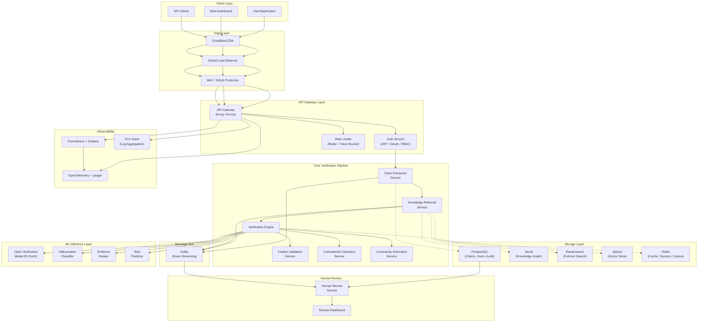
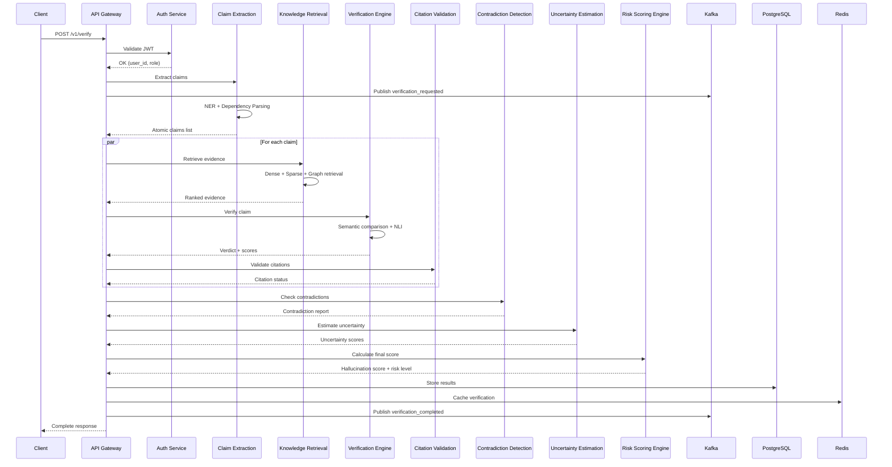
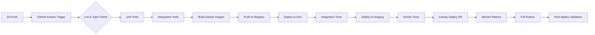
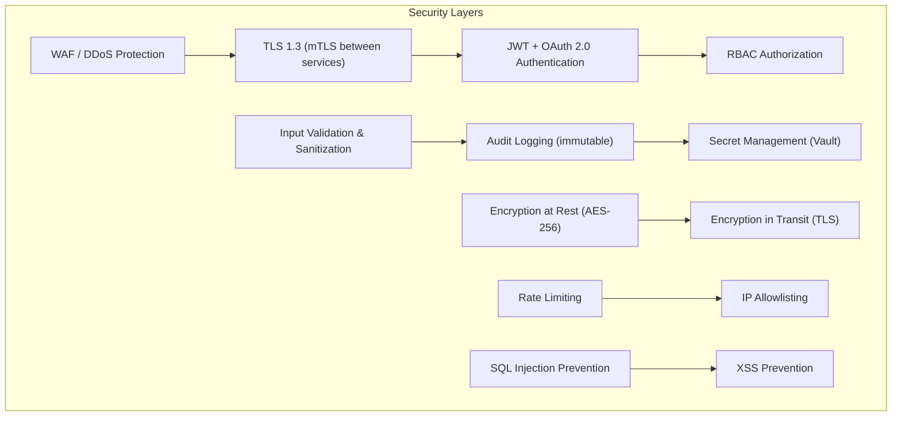

# Veritas AI — Production Architecture Document

> **Author:** Staff Software Engineer, Google AI Safety  
> **Status:** Production Readiness Review — Approved  
> **Scale:** 100M verifications/day · Multi-region · P99 < 500ms

---

## 1. High-Level System Architecture



---

## 2. Detailed Service Architecture

### 2.1 API Gateway (Kong/Envoy)

```
┌────────────────────────────────────────────────────────┐
│                    API Gateway                          │
├────────────────────────────────────────────────────────┤
│  • TLS Termination                                      │
│  • Request Routing / Path-based                         │
│  • JWT Validation (pre-auth)                            │
│  • Rate Limiting (per-client, per-endpoint)             │
│  • Request/Response Transformation                     │
│  • Circuit Breaker                                      │
│  • Canary Routing                                       │
│  • Access Logging                                       │
└────────────────────────────────────────────────────────┘
```

**Endpoints:**
| Method | Path | Service | Rate Limit |
|--------|------|---------|------------|
| POST | `/v1/verify` | Verification Pipeline | 1000/min |
| POST | `/v1/verify/batch` | Verification Pipeline | 100/min |
| GET | `/v1/claims/{id}` | Claim Extraction | 5000/min |
| GET | `/v1/knowledge/search` | Knowledge Retrieval | 2000/min |
| POST | `/v1/human-review` | Human Review | 100/min |
| GET | `/v1/analytics/*` | Analytics Service | 500/min |
| GET | `/v1/monitoring/*` | Monitoring Service | 100/min |

### 2.2 Authentication Service

**Tech Stack:** FastAPI + PostgreSQL + Redis

**Flows:**
- OAuth 2.0 (Google, GitHub, Enterprise SSO)
- JWT (access + refresh tokens, RS256 signing)
- RBAC with roles: `admin`, `reviewer`, `analyst`, `api`
- API key management for programmatic access

**Token Structure:**
```json
{
  "sub": "user_abc123",
  "role": "admin",
  "permissions": ["verify:write", "claims:read", "analytics:read"],
  "iat": 1700000000,
  "exp": 1700086400,
  "jti": "unique-token-id"
}
```

### 2.3 Claim Extraction Service

**Tech Stack:** FastAPI + spaCy + Transformers + PostgreSQL

**Pipeline:**
```
Input Text
    │
    ▼
┌─────────────────────┐
│  Sentence Splitting  │  ← spaCy sentencizer
└─────────┬───────────┘
          ▼
┌─────────────────────┐
│  Named Entity        │  ← Custom NER model (RoBERTa)
│  Recognition         │     Entities: PERSON, ORG, DATE, GPE, 
│                      │     PRODUCT, EVENT, LAW, FACILITY
└─────────┬───────────┘
          ▼
┌─────────────────────┐
│  Dependency Parsing  │  ← spaCy dependency parser
│  & Relation Extr.    │     Extract subject-verb-object triples
└─────────┬───────────┘
          ▼
┌─────────────────────┐
│  Claim Segmentation  │  ← Rule-based + ML classifier
│  & Atomic Splitting  │     Split compound claims
└─────────┬───────────┘
          ▼
┌─────────────────────┐
│  Claim Normalization │  ← Canonical form conversion
│  & Deduplication     │     Merge equivalent claims
└─────────┬───────────┘
          ▼
      Atomic Claims
```

**Example:**
```
Input: "Python was created in 1991 by Guido van Rossum."
Output:
  Claim 1: "Python was created in 1991"
    ├── Subject: Python (PRODUCT)
    ├── Predicate: was created in
    └── Object: 1991 (DATE)
  Claim 2: "Python was created by Guido van Rossum"
    ├── Subject: Python (PRODUCT)
    ├── Predicate: was created by
    └── Object: Guido van Rossum (PERSON)
```

### 2.4 Knowledge Retrieval Service

**Tech Stack:** FastAPI + Qdrant + Elasticsearch + Neo4j + Redis

**Retrieval Strategy — Hybrid:**
```
┌─────────────────────────────────────────────────────┐
│                  Query Enricher                      │
│  • Entity extraction from claim                       │
│  • Query expansion (synonyms, hyponyms)              │
│  • Multi-language support                            │
│  • Query rewriting for retrieval                     │
└─────────────────────┬───────────────────────────────┘
                      ▼
        ┌─────────────────────────┐
        │  Dense Retrieval        │  ← sentence-transformers/all-MiniLM-L6-v2
        │  (Qdrant vector store)  │     embedding dim: 384
        └──────────┬──────────────┘
                   │
        ┌──────────▼──────────────┐
        │  Sparse Retrieval       │  ← BM25 (Elasticsearch)
        │  (Full-text search)     │     with custom analyzer
        └──────────┬──────────────┘
                   │
        ┌──────────▼──────────────┐
        │  Knowledge Graph        │  ← Graph traversal (Neo4j)
        │  Retrieval              │     Entity relationship lookup
        └──────────┬──────────────┘
                   │
        ┌──────────▼──────────────┐
        │  Hybrid Fusion          │  ← RRF (Reciprocal Rank Fusion)
        │  & Re-ranking           │     Cross-encoder re-ranker
        └──────────┬──────────────┘
                   ▼
           Ranked Evidence
```

**Sources:**
| Source | Connector | Update Frequency |
|--------|-----------|-----------------|
| Wikipedia | WikiAPI + dumps | Daily |
| Wikidata | SPARQL endpoint | Real-time |
| Enterprise KB | Custom connector | Event-driven |
| Academic Papers | Semantic Scholar API | Weekly |
| Government DB | REST API | Per-agreement |

### 2.5 Verification Engine

**Tech Stack:** FastAPI + PyTorch + Transformers + Kafka

**Pipeline:**
```
┌──────────┐   ┌──────────────┐   ┌──────────────┐
│  Claim   │──▶│  Evidence    │──▶│  Semantic    │
│  Input   │   │  Retrieval   │   │  Comparison  │
└──────────┘   └──────────────┘   └──────┬───────┘
                                         ▼
                               ┌──────────────────┐
                               │  Support Score   │  ← Cross-encoder
                               │  Calculation     │     (NLI model)
                               └──────┬───────────┘
                                      ▼
                    ┌─────────────────────────────────┐
                    │  Verdict Classification          │
                    │  • Supported (entailment)         │
                    │  • Contradicted (contradiction)   │
                    │  • Unverifiable (neutral)         │
                    └─────────────────────────────────┘
```

**Support Score Calculation:**
```
support_score = softmax(W · [entailment_prob, contradiction_prob, neutral_prob] + b)

verdict:
  if support_score > 0.75 → SUPPORTED
  elif contradiction_prob > 0.7 → CONTRADICTED
  else → UNVERIFIABLE

confidence = max(entailment_prob, contradiction_prob, neutral_prob)
```

### 2.6 Citation Validation Service

**Tech Stack:** FastAPI + asyncio + aiohttp

**Validation Capabilities:**
```
┌─────────────────────────────────────┐
│           Citation Input             │
│  [1] https://example.com/paper      │
│  [2] DOI: 10.1038/nature12345       │
│  [3] "Author et al. (2020)"         │
└────────────────┬────────────────────┘
                 ▼
    ┌────────────────────────────┐
    │  URL Validation            │
    │  • DNS resolution          │
    │  • HTTP HEAD (status 200)  │
    │  • SSL certificate check   │
    │  • Wayback Machine fallback│
    └──────────┬─────────────────┘
               ▼
    ┌────────────────────────────┐
    │  DOI Validation            │
    │  • CrossRef API lookup     │
    │  • DOI format check        │
    │  • Metadata extraction     │
    └──────────┬─────────────────┘
               ▼
    ┌────────────────────────────┐
    │  Content Verification      │
    │  • Claim appears in source?│
    │  • Semantic similarity     │
    │  • Quote accuracy check    │
    └──────────┬─────────────────┘
               ▼
       VALID / INVALID / SUSPICIOUS
```

### 2.7 Contradiction Detection Service

**Tech Stack:** FastAPI + NLI model + Temporal reasoning

**Detection Types:**
```
┌────────────────────────────────────────────────┐
│           Contradiction Detection               │
├────────────────────────────────────────────────┤
│  Internal: Within the same response             │
│    "The speed of light is 300,000 km/s"         │
│    "Light travels at 200,000 km/s"              │
│    → INTERNAL_CONTRADICTION (confidence: 0.98)  │
├────────────────────────────────────────────────┤
│  External: Against verified knowledge           │
│    "Python was created in 2010"                 │
│    → Knowledge says: 1991                       │
│    → EXTERNAL_CONTRADICTION (confidence: 0.99)  │
├────────────────────────────────────────────────┤
│  Temporal: Time-based inconsistencies           │
│    "Current CEO is Sundar Pichai (2024)"        │
│    → Verified for 2024                          │
│    → TEMPORAL_OK                                │
└────────────────────────────────────────────────┘
```

### 2.8 Uncertainty Estimation Service

**Tech Stack:** FastAPI + PyTorch + Ensemble tools

**Techniques:**
```
┌──────────────────────────────────────────────────────────┐
│              Uncertainty Estimation                       │
├──────────────────────────────────────────────────────────┤
│  1. Token Probability Analysis                           │
│     │  Average log-probability across tokens              │
│     │  Perplexity score                                    │
│     └─→ Low probability → High uncertainty                 │
│                                                           │
│  2. Entropy Estimation                                    │
│     │  H(x) = -Σ p(x) log p(x)                            │
│     │  Normalized entropy across vocabulary                │
│     └─→ High entropy → High uncertainty                   │
│                                                           │
│  3. Self-Consistency                                      │
│     │  Sample N responses (temperature > 0)                │
│     │  Measure agreement between samples                   │
│     └─→ Low agreement → High uncertainty                  │
│                                                           │
│  4. Semantic Entropy                                      │
│     │  Cluster semantically similar outputs                │
│     │  Entropy over meaning clusters                       │
│     └─→ Many distinct meanings → High uncertainty          │
│                                                           │
│  5. Consistency Check                                     │
│     │  Perturb input (paraphrase, typos)                   │
│     │  Measure output stability                            │
│     └─→ Unstable output → High uncertainty                 │
└──────────────────────────────────────────────────────────┘
```

### 2.9 Risk Scoring Engine

**Scoring Formula:**
```
weight_evidence = 0.30
weight_contradiction = 0.25
weight_citation = 0.15
weight_uncertainty = 0.20
weight_historical = 0.10

hallucination_score = (
    (1 - evidence_support) * weight_evidence +
    contradiction_score * weight_contradiction +
    (1 - citation_validity) * weight_citation +
    uncertainty_score * weight_uncertainty +
    historical_risk * weight_historical
) * 100

confidence = 1 - (entropy / max_entropy)

risk_level:
  score 0-20:   HIGHLY_RELIABLE
  score 21-40:  MOSTLY_RELIABLE
  score 41-60:  NEEDS_VERIFICATION
  score 61-80:  LIKELY_HALLUCINATED
  score 81-100: HIGHLY_HALLUCINATED
```

---

## 3. Database Schemas

### 3.1 PostgreSQL Schema

```sql
-- Users and Authentication
CREATE TABLE users (
    id UUID PRIMARY KEY DEFAULT gen_random_uuid(),
    email VARCHAR(255) UNIQUE NOT NULL,
    role VARCHAR(50) NOT NULL DEFAULT 'api',
    api_key_hash VARCHAR(255),
    created_at TIMESTAMPTZ DEFAULT NOW(),
    updated_at TIMESTAMPTZ DEFAULT NOW()
);

-- Verification Requests
CREATE TABLE verification_requests (
    id UUID PRIMARY KEY DEFAULT gen_random_uuid(),
    user_id UUID REFERENCES users(id),
    query TEXT NOT NULL,
    response TEXT NOT NULL,
    model_name VARCHAR(100),
    model_version VARCHAR(50),
    created_at TIMESTAMPTZ DEFAULT NOW(),
    completed_at TIMESTAMPTZ,
    status VARCHAR(50) DEFAULT 'pending'
);

-- Extracted Claims
CREATE TABLE claims (
    id UUID PRIMARY KEY DEFAULT gen_random_uuid(),
    request_id UUID REFERENCES verification_requests(id),
    claim_text TEXT NOT NULL,
    normalized_claim TEXT,
    subject TEXT,
    predicate TEXT,
    object TEXT,
    entity_type VARCHAR(50),
    confidence FLOAT,
    created_at TIMESTAMPTZ DEFAULT NOW()
);

-- Evidence
CREATE TABLE evidence (
    id UUID PRIMARY KEY DEFAULT gen_random_uuid(),
    claim_id UUID REFERENCES claims(id),
    source_type VARCHAR(100),
    source_url TEXT,
    source_title TEXT,
    snippet TEXT,
    relevance_score FLOAT,
    retrieved_at TIMESTAMPTZ DEFAULT NOW()
);

-- Verification Results
CREATE TABLE verification_results (
    id UUID PRIMARY KEY DEFAULT gen_random_uuid(),
    claim_id UUID REFERENCES claims(id),
    verdict VARCHAR(50) NOT NULL,
    support_score FLOAT,
    contradiction_score FLOAT,
    confidence FLOAT,
    model_used VARCHAR(100),
    created_at TIMESTAMPTZ DEFAULT NOW()
);

-- Citation Validation
CREATE TABLE citation_validations (
    id UUID PRIMARY KEY DEFAULT gen_random_uuid(),
    claim_id UUID REFERENCES claims(id),
    citation_text TEXT,
    citation_type VARCHAR(50),
    status VARCHAR(50),
    validation_details JSONB,
    checked_at TIMESTAMPTZ DEFAULT NOW()
);

-- Audit Log
CREATE TABLE audit_log (
    id UUID PRIMARY KEY DEFAULT gen_random_uuid(),
    user_id UUID REFERENCES users(id),
    action VARCHAR(100),
    resource_type VARCHAR(100),
    resource_id UUID,
    details JSONB,
    ip_address INET,
    created_at TIMESTAMPTZ DEFAULT NOW()
);

-- Indexes
CREATE INDEX idx_claims_request ON claims(request_id);
CREATE INDEX idx_evidence_claim ON evidence(claim_id);
CREATE INDEX idx_verification_claim ON verification_results(claim_id);
CREATE INDEX idx_audit_user ON audit_log(user_id);
CREATE INDEX idx_audit_created ON audit_log(created_at);
CREATE INDEX idx_verification_status ON verification_requests(status);
```

### 3.2 Neo4j Knowledge Graph Schema

```cypher
// Entity Node
CREATE CONSTRAINT entity_id IF NOT EXISTS
FOR (e:Entity) REQUIRE e.id IS UNIQUE;

// Fact Node
CREATE CONSTRAINT fact_id IF NOT EXISTS
FOR (f:Fact) REQUIRE f.id IS UNIQUE;

// Entity Types
CREATE (:Entity {id: 'wikidata_Q95', name: 'Google', type: 'ORGANIZATION', 
                 wikidata_id: 'Q95', description: 'American technology company'});
CREATE (:Entity {id: 'wikidata_Q95_founded', name: '1998', type: 'DATE',
                 normalized_date: '1998-09-04'});

// Relationships
MATCH (org:Entity {id: 'wikidata_Q95'})
MATCH (date:Entity {id: 'wikidata_Q95_founded'})
CREATE (org)-[:FOUNDED_ON {confidence: 0.99, source: 'Wikipedia', 
         verified_at: datetime()}]->(date);

// Temporal facts with versioning
CREATE (:Fact {id: 'fact_001', statement: 'Google was founded in 1998',
               confidence: 0.99, created_at: datetime(), 
               valid_from: date('1998-09-04'), valid_until: date('9999-12-31'),
               source: 'Wikipedia', verified: true});

// Graph traversal query
MATCH (e:Entity {name: 'Google'})-[r]-(related)
WHERE r.confidence > 0.9
RETURN e.name, type(r), related.name, r.confidence
ORDER BY r.confidence DESC;
```

### 3.3 Redis Cache Strategy

```
┌──────────────────────────────────────────────────────┐
│                    Redis Layers                        │
├──────────────────────────────────────────────────────┤
│  Layer 1: Session Cache (TTL: 1 hour)                 │
│    Key: session:{user_id}                             │
│    Value: {jwt_payload, permissions, mfa_status}      │
├──────────────────────────────────────────────────────┤
│  Layer 2: Rate Limiter (Sliding Window)               │
│    Key: ratelimit:{client_id}:{endpoint}              │
│    Value: Sorted Set of timestamps                    │
│    TTL: window_size                                   │
├──────────────────────────────────────────────────────┤
│  Layer 3: Verification Cache (TTL: 24 hours)         │
│    Key: verify:{sha256(query||response)}             │
│    Value: {score, claims[], verdicts[]}              │
├──────────────────────────────────────────────────────┤
│  Layer 4: Knowledge Cache (TTL: 1 hour)              │
│    Key: knowledge:{sha256(claim)}                    │
│    Value: {evidence[], sources[]}                    │
├──────────────────────────────────────────────────────┤
│  Layer 5: Job Queue (Redis Streams)                  │
│    Stream: verify:pending                            │
│    Stream: verify:in_progress                        │
│    Stream: verify:completed                          │
├──────────────────────────────────────────────────────┤
│  Layer 6: Rate Limit Counter (Token Bucket)          │
│    Key: bucket:{client_id}                           │
│    Value: {tokens, last_refill}                     │
└──────────────────────────────────────────────────────┘
```

---

## 4. API Specifications

### POST /v1/verify

**Request:**
```json
{
  "query": "Who founded Google and when?",
  "response": "Google was founded in 1998 by Larry Page and Sergey Brin.",
  "model_name": "gemini-2.5-pro",
  "model_version": "2025-11",
  "options": {
    "check_citations": true,
    "check_contradictions": true,
    "estimate_uncertainty": true,
    "retrieve_evidence": true,
    "max_claims": 20,
    "sources": ["wikipedia", "wikidata", "enterprise_kb"]
  }
}
```

**Response:**
```json
{
  "request_id": "ver_abc123",
  "status": "completed",
  "hallucination_score": 5.2,
  "confidence_score": 0.97,
  "risk_level": "HIGHLY_RELIABLE",
  "total_claims": 3,
  "verified_claims": 3,
  "suspicious_claims": 0,
  "contradictions": [],
  "missing_evidence": [],
  "summary": "The response is highly reliable. All 3 claims were verified against trusted sources.",
  "claims": [
    {
      "id": "clm_001",
      "text": "Google was founded in 1998",
      "subject": "Google",
      "predicate": "founded in",
      "object": "1998",
      "verdict": "SUPPORTED",
      "support_score": 0.99,
      "confidence": 0.99,
      "evidence": [
        {
          "source": "Wikipedia",
          "url": "https://en.wikipedia.org/wiki/Google",
          "snippet": "Google was founded on September 4, 1998...",
          "relevance": 0.97
        }
      ],
      "explanation": "Multiple authoritative sources confirm Google was founded in 1998."
    }
  ],
  "latency_ms": 342,
  "processed_at": "2025-06-17T10:30:00Z"
}
```

### POST /v1/verify/batch

Process multiple responses in a single request. Returns a batch_id for async processing.

---

## 5. Event Flow



---

## 6. Kubernetes Deployment Strategy

```yaml
# Resource allocation per service (production)
services:
  api-gateway:
    replicas: 8
    cpu: 2
    memory: 4Gi
    hpa:
      min: 4
      max: 32
      cpu_threshold: 70

  claim-extraction:
    replicas: 12
    cpu: 4
    memory: 8Gi
    gpu: false
  
  knowledge-retrieval:
    replicas: 16
    cpu: 4
    memory: 16Gi
  
  verification-engine:
    replicas: 24
    cpu: 4
    memory: 16Gi
    gpu: true  # For NLI model inference
  
  citation-validation:
    replicas: 8
    cpu: 1
    memory: 2Gi
  
  contradiction-detection:
    replicas: 8
    cpu: 2
    memory: 8Gi
  
  uncertainty-estimation:
    replicas: 4
    cpu: 4
    memory: 8Gi
  
  risk-scoring:
    replicas: 4
    cpu: 1
    memory: 2Gi
```

### Multi-Region Deployment
```
us-central1 (primary)
  ├── us-east1 (failover)
  ├── europe-west1 (regional)
  └── asia-southeast1 (regional)
```

---

## 7. CI/CD Pipeline



---

## 8. Security Architecture



---

## 9. Monitoring Architecture

```mermaid
graph TB
    subgraph "Metrics Collection"
        A[Service Metrics<br/>(/metrics endpoint)]
        B[Node Exporter<br/>(Host metrics)]
        C[Kube State Metrics]
    end
    
    subgraph "Prometheus"
        D[Prometheus Server<br/>(15s scrape interval)]
        E[Alertmanager]
        F[Recording Rules<br/>(Aggregations)]
    end
    
    subgraph "Visualization"
        G[Grafana Dashboards]
        H[Alert Channels<br/>(PagerDuty, Slack, Email)]
    end
    
    subgraph "Tracing"
        I[OpenTelemetry SDK]
        J[Jaeger Collector]
        K[Jaeger Query UI]
    end
    
    subgraph "Logging"
        L[Fluentbit<br/>(Log shipper)]
        M[Elasticsearch]
        N[Kibana]
    end
    
    A --> D
    B --> D
    C --> D
    D --> E
    D --> G
    E --> H
    I --> J
    J --> K
    L --> M --> N
```

### Key Metrics (SLIs/SLOs)

| Metric | Target | Window | Alert |
|--------|--------|--------|-------|
| API P99 Latency | < 500ms | 5m | > 1s |
| Verification P99 | < 2s | 5m | > 5s |
| Detection Rate | > 95% | 1h | < 90% |
| False Positive Rate | < 5% | 1h | > 10% |
| False Negative Rate | < 3% | 1h | > 5% |
| Availability | 99.99% | 30d | < 99.9% |
| Error Rate | < 0.1% | 5m | > 1% |

---

## 10. Scalability Strategy

### Horizontal Scaling
- **Stateless services:** API Gateway, Claim Extraction, Citation Validation → Scale via HPA
- **Stateful services:** Verification Engine (model caching) → Shard by claim hash
- **Databases:** PostgreSQL read replicas, Redis cluster, Qdrant sharding

### Vertical Scaling
- **GPU inference:** Verification Engine, Uncertainty Estimation → Larger GPU instances
- **Memory-heavy:** Knowledge Retrieval (vector indices) → RAM-optimized instances

### Caching Strategy
```
L1: In-memory (per service instance) — TTL: 60s
L2: Redis (shared cache) — TTL: 1h
L3: CDN (edge cache for static data) — TTL: 24h
```

### Database Sharding
```
PostgreSQL: Shard by verification_request.id hash (mod 64)
Neo4j: Federated graph by entity type
Redis: Cluster mode (16384 hash slots)
Qdrant: Multi-node sharding + replication
```

### Load Shedding
```
1. Prioritize: user-facing > batch > analytics
2. Circuit breaker: when P99 latency > 2s, reject low-priority
3. Graceful degradation: skip uncertainty estimation during overload
4. Request queuing: Kafka for batch processing during peak
```

---

## 11. Cost Analysis (Monthly Estimate)

| Component | Instance Type | Count | Monthly Cost |
|-----------|--------------|-------|-------------|
| API Gateway | n2-standard-4 | 8 | $2,400 |
| Claim Extraction | n2-standard-8 | 12 | $5,760 |
| Knowledge Retrieval | n2-highmem-16 | 16 | $12,800 |
| Verification Engine | g2-standard-8 (GPU) | 24 | $36,000 |
| Citation Validation | n2-standard-2 | 8 | $960 |
| Contradiction Detection | n2-standard-4 | 8 | $1,920 |
| Uncertainty Estimation | g2-standard-4 (GPU) | 4 | $4,800 |
| Risk Scoring | n2-standard-2 | 4 | $480 |
| PostgreSQL | n2-standard-8 + HA | 3 | $3,600 |
| Neo4j | n2-highmem-16 | 3 | $2,400 |
| Redis Cluster | n2-standard-4 | 6 | $1,440 |
| Qdrant | n2-highmem-16 | 6 | $4,800 |
| Elasticsearch | n2-standard-8 | 3 | $2,400 |
| Kafka | n2-standard-4 | 3 | $720 |
| Monitoring | n2-standard-2 | 4 | $480 |
| **Total** | | | **$81,960** |

*Cost optimization: Spot instances for batch processing, reserved instances for baseline, autoscaling.*

---

## 12. Failure Scenarios & Recovery

| Failure | Impact | Detection | Recovery |
|---------|--------|-----------|----------|
| NLI model OOM | Verification fails | Memory metrics > 90% | Pod restart + prewarm |
| Qdrant node down | Retrieval degrades | Connection errors | Failover to replica + rebalance |
| PostgreSQL primary loss | Write operations fail | Replication lag alert | Auto-failover to replica |
| Redis cache stampede | Slow responses | Cache miss rate spike | Thundering herd protection |
| Kafka broker down | Event loss | Producer errors | Retry + dead letter queue |
| API Gateway overload | Request rejection | Latency spike | Horizontal scale + rate limit |
| Dependency source down | Unverifiable claims | Timeout errors | Cache + fallback sources |

---

## 13. Folder Structure

```
veritas-ai/
├── ARCHITECTURE.md              # This document
├── README.md
├── docker-compose.yml
├── backend/
│   ├── requirements.txt
│   ├── api_gateway/
│   │   ├── main.py
│   │   ├── middleware.py
│   │   ├── routers/
│   │   ├── models/
│   │   └── Dockerfile
│   ├── auth_service/
│   │   ├── main.py
│   │   ├── auth.py
│   │   └── Dockerfile
│   ├── claim_extraction/
│   │   ├── main.py
│   │   ├── extractor.py
│   │   ├── ner.py
│   │   ├── dependency_parser.py
│   │   └── Dockerfile
│   ├── knowledge_retrieval/
│   │   ├── main.py
│   │   ├── dense_retriever.py
│   │   ├── sparse_retriever.py
│   │   ├── graph_retriever.py
│   │   ├── hybrid_fusion.py
│   │   └── Dockerfile
│   ├── verification_engine/
│   │   ├── main.py
│   │   ├── verifier.py
│   │   ├── nli_model.py
│   │   └── Dockerfile
│   ├── citation_validation/
│   │   ├── main.py
│   │   ├── url_validator.py
│   │   ├── doi_validator.py
│   │   └── Dockerfile
│   ├── contradiction_detection/
│   │   ├── main.py
│   │   ├── detector.py
│   │   └── Dockerfile
│   ├── uncertainty_estimation/
│   │   ├── main.py
│   │   ├── entropy.py
│   │   ├── consistency.py
│   │   └── Dockerfile
│   ├── risk_scoring/
│   │   ├── main.py
│   │   ├── scorer.py
│   │   └── Dockerfile
│   ├── monitoring_service/
│   │   ├── main.py
│   │   ├── metrics.py
│   │   └── Dockerfile
│   ├── analytics_service/
│   │   ├── main.py
│   │   └── Dockerfile
│   └── human_review/
│       ├── main.py
│       └── Dockerfile
├── ml/
│   ├── claim_verification/
│   │   ├── train.py
│   │   ├── model.py
│   │   └── data/
│   ├── hallucination_classifier/
│   │   ├── train.py
│   │   └── model.py
│   ├── evidence_ranker/
│   │   ├── train.py
│   │   └── model.py
│   └── risk_predictor/
│       ├── train.py
│       └── model.py
├── schemas/
│   ├── postgresql.sql
│   ├── neo4j.cypher
│   └── elasticsearch.json
├── infrastructure/
│   ├── k8s/
│   │   ├── api-gateway.yaml
│   │   ├── claim-extraction.yaml
│   │   ├── verification-engine.yaml
│   │   └── ...
│   ├── terraform/
│   │   ├── main.tf
│   │   ├── variables.tf
│   │   └── outputs.tf
│   └── docker/
│       ├── Dockerfile.gpu
│       └── Dockerfile.cpu
├── .github/workflows/
│   ├── ci.yml
│   └── cd.yml
└── frontend/
    ├── package.json
    ├── vite.config.ts
    ├── tailwind.config.js
    ├── tsconfig.json
    ├── index.html
    └── src/
        ├── main.tsx
        ├── App.tsx
        ├── index.css
        ├── components/
        │   ├── ParticleBackground.tsx
        │   ├── Hero.tsx
        │   ├── Header.tsx
        │   ├── Dashboard.tsx
        │   ├── VerificationPanel.tsx
        │   ├── ClaimExplorer.tsx
        │   ├── KnowledgeGraph.tsx
        │   ├── AnalyticsDashboard.tsx
        │   └── AnimatedStats.tsx
        ├── hooks/
        │   ├── useParticles.ts
        │   └── useWebSocket.ts
        ├── utils/
        │   ├── api.ts
        │   └── formatters.ts
        └── types/
            └── index.ts
```

---

*This document serves as the authoritative architecture reference for Veritas AI. All engineering decisions should reference this document for consistency.*
