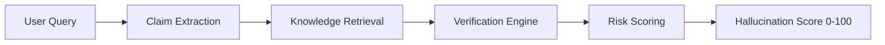

# Veritas AI — Hallucination Detection Platform

**Production-grade AI verification system for detecting, scoring, explaining, and preventing LLM hallucinations at scale.**

> Designed for Google Search, Gemini, enterprise copilots, healthcare assistants, legal assistants, and customer support systems where factual correctness is critical.

## System Overview



**Scale:** 100 million verifications/day · Multi-region · P99 < 500ms

## Architecture — 12 Microservices

| Service | Responsibility | Tech |
|---------|---------------|------|
| API Gateway | Routing, auth, rate limiting | Kong/Envoy + FastAPI |
| Authentication | JWT, OAuth 2.0, RBAC | FastAPI + PostgreSQL |
| Claim Extraction | NER, dependency parsing, segmentation | spaCy + Transformers |
| Knowledge Retrieval | Dense + sparse + graph retrieval | Qdrant + ES + Neo4j |
| Verification Engine | NLI-based claim verification | PyTorch + RoBERTa |
| Citation Validation | URL, DOI, author verification | aiohttp + asyncio |
| Contradiction Detection | Internal/external/temporal checks | NLI + temporal logic |
| Uncertainty Estimation | Entropy, consistency, ensemble | PyTorch |
| Risk Scoring | Multi-factor scoring | MLP ensemble |
| Monitoring | Prometheus, Grafana, OTEL | OpenTelemetry |
| Analytics | Real-time dashboards | FastAPI + PostgreSQL |
| Human Review | Human-in-the-loop | FastAPI + React |

## Quick Start

```bash
# Backend
cd backend
pip install -r requirements.txt
uvicorn api_gateway.main:app --port 8000

# Frontend
cd frontend
npm install
npm run dev

# Full stack with Docker
docker compose up
```

## Verification Pipeline

```
Input (query + response)
  ↓
Claim Extraction (NER + dependency parsing)
  ↓
Hybrid Retrieval (dense + sparse + graph)
  ↓
Verification (NLI entailment/contradiction)
  ↓
Citation Validation (URL/DOI checks)
  ↓
Contradiction Detection (internal/external)
  ↓
Uncertainty Estimation (entropy/consistency)
  ↓
Risk Scoring (weighted ensemble)
  ↓
Output (score + explanation + corrections)
```

## API

### POST /v1/verify

```json
{
  "query": "Who founded Google?",
  "response": "Google was founded in 1998 by Larry Page and Sergey Brin."
}
```

```json
{
  "hallucination_score": 5.2,
  "risk_level": "HIGHLY_RELIABLE",
  "total_claims": 3,
  "verified_claims": 3
}
```

## ML Models

| Model | Architecture | Task |
|-------|-------------|------|
| Claim Verifier | RoBERTa-large | NLI entailment/contradiction |
| Hallucination Classifier | DeBERTa-v3 | Binary + multi-class risk |
| Evidence Ranker | Cross-encoder | Re-ranking retrieval |
| Risk Predictor | MLP 64→32→16→2 | Final score regression |

## Infrastructure

- **Container:** Docker + Kubernetes (GKE)
- **Database:** PostgreSQL (sharded), Neo4j, Redis Cluster
- **Search:** Elasticsearch, Qdrant (vector)
- **Queue:** Kafka (event streaming)
- **Observability:** Prometheus + Grafana + OpenTelemetry + Jaeger
- **CI/CD:** GitHub Actions → Canary → Full Rollout
- **IaC:** Terraform (multi-region GCP)
